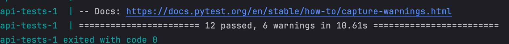
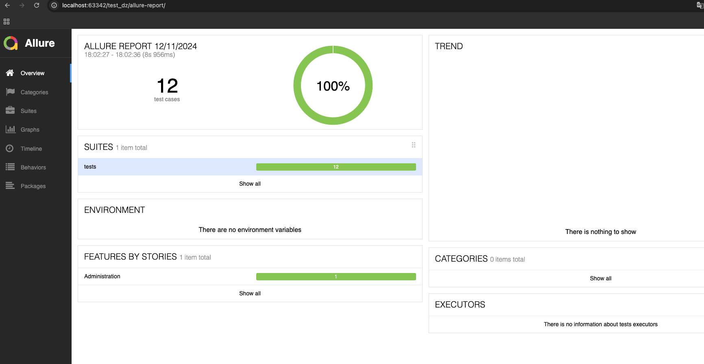
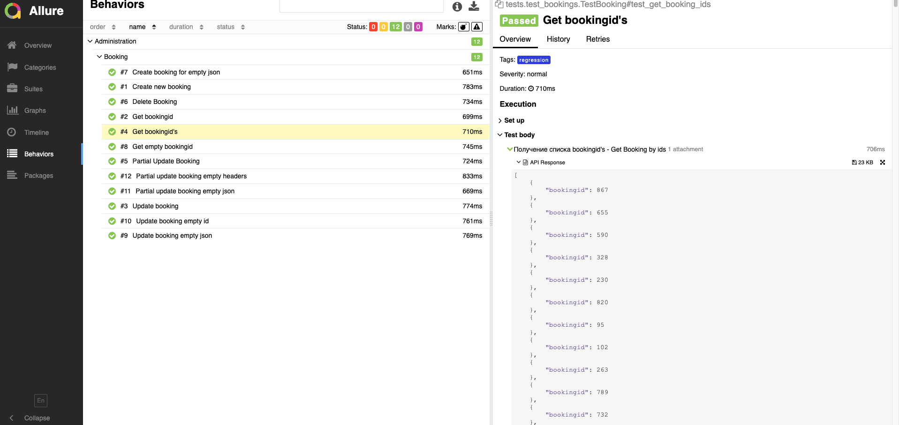

# Тестовое задание

### Задание 1: Поиск потомка (ui)

``` 
Откройте страницу http://suninjuly.github.io/cats.html. 
Откройте консоль разработчика и вкладку Elements в ней. 

Напишите минимально достаточный CSS-селектор, который найдет элемент с картинкой серьезного кота (Serious cat).
Для поиска подходящего элемента в каталоге картинок используйте родительский элемент div.col-sm-4 вместе с псевдо-классом :nth-child(n),
 чтобы выбрать n-й по счету элемент, а также селектор для картинки по тегу img. При написании этого селектора не надо использовать символ >,
 т.к. это задача на поиск потомка без использования дочерних элементов. Для решения достаточно тех селекторов, которые уже указаны в задании.

Пожалуйста, не используйте селекторы, которые генерирует браузер по кнопке "скопировать css селектор" или расширения.
 Зачастую они строят полный путь, начиная от body — а это очень нестабильный селектор,
 писать такие в своем коде это плохая практика. При малейшем изменении структуры страницы все ваши селекторы потеряют актуальность. 

Не используйте в синтаксисе квадратные скобки — конструкции вида [class="stepic"].

Введите найденный селектор в качестве ответа на это задание. 
```
### Ответ: 

#### Предусловия:

- Перейдите по ссылке http://suninjuly.github.io/cats.html
- Перейдите в Devtools (вкладка Elements)
- Нажмите горячие клавиши для поиска элементов по селекторам или xpath (в моем случае ctrl + f)

#### Шаги:

- Выполните поиск введя селектор со значением ```div.col-sm-4:nth-child(2) img```

#### Результат:

- Найден элемент с картинкой серьезного кота (Serious cat)

### Задание 2: Забронировать условный отель

```
Изучите документацию API https://restful-booker.herokuapp.com/apidoc/index.html
Вам необходимо написать позитивные и негативные API тесты, которые представлены на странице документации.
Кроме того, параметризируйте и добавьте фикстуры в тех местах, где это возможно по вашему мнению. 
Итоговую отчетность отобразить в Allure Framework.
```

#### Предусловия:

- Запуск через pipeline - требует актуальных значений BOOKING_ID и SESSION_ID, без данной актуальности - будет фейлиться.
- Allure отчетность можно также просмотреть в gitlab -> вкладка deploy -> pages -> перейти по ссылке
- Запускать предпочтительнее локально через команды (также первый запуск будет фейлиться, а последующий будет уже с актуальными значениями из env файла):

#### Установить зависимости

```pip install -r requirements.txt```

#### Запуск тестов (локально создается в корневой директории - директория 'allure-results')
```
docker compose up api-tests
```

<p align="center">
  
</p>

#### Создание allure отчета (локально создается в корневой директории - директория 'allure-report')
```
docker compose up report
```

#### Просмотреть allure отчет - следует открыть директорию allure-report и открыть файл index.html

<p align="center">
  
</p>

<p align="center">
  
</p>
